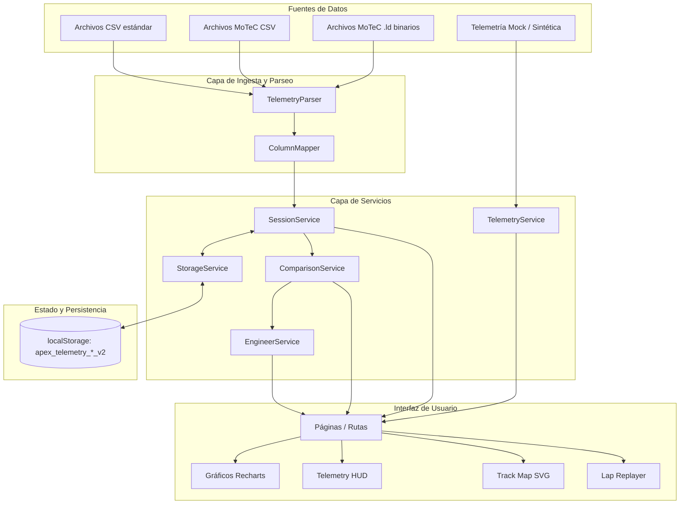

Okay,,# Arquitectura Técnica de ApexTelemetry

Este documento describe la arquitectura del sistema, el flujo de datos, la estructura modular y los principios de diseño implementados en **ApexTelemetry**.

---

## 1. Visión General del Sistema

ApexTelemetry es una Single Page Application (SPA) cliente-servidorless construida sobre **React 19**, **TypeScript** y **Vite**. La plataforma está optimizada para procesar, sincronizar y visualizar datos de telemetría de alta frecuencia provenientes de simuladores de carreras (iRacing, Assetto Corsa Competizione, rFactor 2, MoTeC).

Toda la computación analítica (alineación por distancia, detección de fases de frenada, cálculo de deltas y análisis del ingeniero de pista) se ejecuta directamente en el navegador del usuario utilizando estructuras de datos optimizadas en memoria y persistencia local en `localStorage`.



---

## 2. Estructura de Directorios

La base del código sigue una separación clara de responsabilidades:

```
src/
├── assets/                  # Logotipos, íconos vectoriales e imágenes estáticas
├── components/
│   ├── comparison/          # Gráficos superpuestos (Delta, Velocidad, Pedales)
│   ├── engineer/            # Tarjetas de recomendaciones del Ingeniero Virtual
│   ├── layout/              # Sidebar de navegación, Topbar y Shell (MainLayout)
│   ├── telemetry/           # Componentes de telemetría (HUD, TrackMap, LapReplayer, Charts)
│   └── ui/                  # Componentes base reutilizables (Button, Badge, Modal, StatCard)
├── data/                    # Datos iniciales / Mocks (coches, circuitos, sesiones de ejemplo)
├── pages/                   # Vistas principales de la aplicación
│   ├── Cars/                # Catálogo de vehículos y especificaciones
│   ├── Comparison/          # Comparador de vueltas cara a cara
│   ├── Dashboard/           # Panel de control de KPIs y actividad reciente
│   ├── Goals/               # Sistema de metas y objetivos del piloto
│   ├── Import/              # Asistente de carga y mapeo de archivos de telemetría
│   ├── LapAnalysis/         # Análisis profundo de telemetría por vuelta
│   ├── Progress/            # Evolución histórica y consistencia del piloto
│   ├── SessionDetail/       # Detalle de sesión individual y tabla de vueltas
│   ├── Sessions/            # Listado global de sesiones con filtrado
│   ├── Settings/            # Preferencias de unidades y perfil de piloto
│   └── Tracks/              # Catálogo de circuitos y detalles de curvas
├── services/                # Lógica de negocio, parseo, análisis y persistencia
├── types/                   # Definiciones de TypeScript e interfaces del dominio
├── utils/                   # Utilidades de formateo (tiempo, deltas) y geometría SVG
├── App.tsx                  # Enrutador principal de React Router
└── main.tsx                 # Punto de entrada de la aplicación
```

---

## 3. Modelo de Datos Central

Las interfaces principales residen en [`src/types/index.ts`](file:///c:/Programming/ApexTelemetry/src/types/index.ts):

### `TelemetryPoint`
Representa una muestra instantánea en un punto de la pista:
- `distance`: Distancia recorrida desde el inicio de la vuelta (metros). Clave para alineación espacial.
- `time`: Tiempo acumulado de la vuelta (segundos).
- `speed`: Velocidad del vehículo (km/h).
- `throttle` / `brake`: Porcentaje de recorrido de los pedales (0 a 100%).
- `gear`: Marcha actual (0 = neutral/reversa, 1-6/7/8).
- `rpm`: Revoluciones por minuto del motor.
- `steering`: Ángulo del volante en grados (-180° a +180°).
- `x`, `y`: Coordenadas relativas 2D para renderizado en mapa SVG.

### `Lap` y `Session`
- **`Lap`**: Contiene el tiempo total, si es vuelta válida (track limits), mejor marca personal (`isPersonalBest`), desglose de 3 sectores (`sectors`) y arreglo de `telemetry` de tipo `TelemetryPoint[]`.
- **`Session`**: Agrupa vueltas de un tipo (`Practice`, `Qualifying`, `Race`, `Hotlap`), coche (`carId`), circuito (`trackId`), condiciones climáticas y estadísticas agregadas (vuelta rápida, promedio, vueltas totales).

---

## 4. Capa de Servicios

Los servicios están implementados como clases estáticas o funciones puras para desacoplar la lógica de cálculo de los componentes visuales:

### 1. `StorageService` ([`src/services/storageService.ts`](file:///c:/Programming/ApexTelemetry/src/services/storageService.ts))
- Gestiona la persistencia en el `localStorage` del navegador.
- Emplea claves versionadas (`apex_telemetry_sessions_v2`, `apex_telemetry_goals_v2`, `apex_telemetry_driver_v2`).
- Limpia automáticamente estructuras obsoletas de versiones previas.
- Ofrece métodos para respaldar (`export`), restaurar y restablecer la base de datos local a los valores por defecto.

### 2. `TelemetryParser` ([`src/services/telemetryParser.ts`](file:///c:/Programming/ApexTelemetry/src/services/telemetryParser.ts))
Capaz de procesar múltiples formatos de telemetría de simulación:
- **CSV Estándar**: Parseo tabular rápido con delimitadores comunes.
- **MoTeC CSV**: Detecta bloques de metadatos superiores (`Format`, `Venue`, `Vehicle`, `Driver`, `Sample Rate`) y descarta líneas secundarias de unidades técnicas.
- **MoTeC Binario (`.ld`)**: Lectura directa de bajo nivel mediante `DataView` y `ArrayBuffer`. Extrae cadenas ASCII de cabecera y directorios de canales en offsets estándar (0x40, 0x5e, 0x7e, etc.).
- **Mapeo Inteligente**: Mecanismo de coincidencia difusa para reconocer variantes comunes de nombres de canales (`Speed`, `Ground Speed`, `v_car`, `Throttle`, `Acc_Pedal`, `Brake_Press`, `Steering_Angle`, etc.).

### 3. `ComparisonService` ([`src/services/comparisonService.ts`](file:///c:/Programming/ApexTelemetry/src/services/comparisonService.ts))
- **Alineación por Distancia**: Las vueltas no se comparan por tiempo transcurrido, sino por metro recorrido a lo largo de la pista.
- Realiza una búsqueda del punto espacial más próximo para cada distancia común.
- Calcula el delta temporal acumulado (`timeA - timeB`) en cada metro para identificar instantáneamente en qué tramos se gana o se pierde tiempo.

### 4. `EngineerService` ([`src/services/engineerService.ts`](file:///c:/Programming/ApexTelemetry/src/services/engineerService.ts))
Motor de reglas analíticas que evalúa el rendimiento del piloto frente a una vuelta de referencia en ventanas específicas de cada curva:
1. **Punto de Frenada**: Compara la distancia donde el pedal de freno supera el 20%. Si el piloto frena >8m antes, genera una recomendación advirtiendo sobre frenada prematura.
2. **Velocidad Mínima en el Ápice**: Evalúa la velocidad mínima en la zona media de la curva ($\pm 25$m del ápice). Identifica pérdidas de momento o reconoce velocidad de paso óptima.
3. **Punto de Aceleración a Fondo**: Detecta dónde el pedal de acelerador alcanza el 90% a la salida de la curva (+10m a +70m) para reportar dudas o retrasos en la tracción.

### 5. `TelemetryService` ([`src/services/telemetryService.ts`](file:///c:/Programming/ApexTelemetry/src/services/telemetryService.ts))
- Generador estocástico determinista de telemetría sintética de alta densidad (~280-350 puntos por vuelta).
- Simula cinemática realista de un coche GT3 basada en la longitud del circuito, curvatura y radios de giro, aceleraciones laterales, retardo de ABS y relaciones de transmisión.

---

## 5. Visualización y Componentes Clave

- **Recharts**: Gráficos de alta fidelidad con áreas sombreadas para acelerador/freno, curvas de velocidad y visualización de delta de tiempo con línea de cero.
- **TrackMap SVG** ([`src/components/telemetry/TrackMap.tsx`](file:///c:/Programming/ApexTelemetry/src/components/telemetry/TrackMap.tsx)): Genera la silueta del circuito a partir de vectores geométricos, dibuja sectores y posiciona un cursor interactivo sincronizado con la reproducción.
- **LapReplayer** ([`src/components/telemetry/LapReplayer.tsx`](file:///c:/Programming/ApexTelemetry/src/components/telemetry/LapReplayer.tsx)): Bucle de animación impulsado por `requestAnimationFrame` que permite reproducir la vuelta a velocidades 0.5x, 1x, 2x y 4x, con barra de progreso arrastrable.
- **TelemetryHUD** ([`src/components/telemetry/TelemetryHUD.tsx`](file:///c:/Programming/ApexTelemetry/src/components/telemetry/TelemetryHUD.tsx)): Cuadro de mandos digital interactivo con tacómetro digital de RPM con zona roja, velocímetro, marcha actual e indicadores de barras de pedales.

